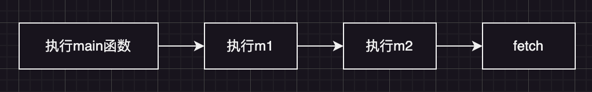
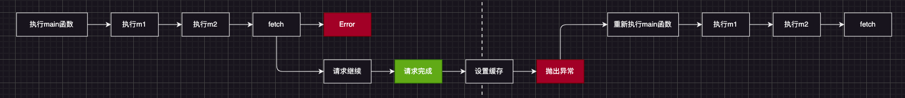
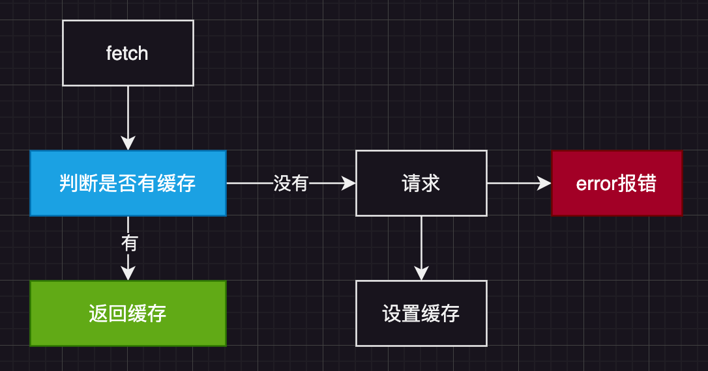

## 消除异步的传染性

先看一个例子

```js
async function getTest() {
  return await fetch("http://localhost:3333/test");
}

async function m2() {
  return await getTest();
}

async function m1() {
  return await m2();
}

async function main() {
  const data = await m1();
  console.log("data", data);
}
```

上面这个例子，只是由于要请求接口，所有的函数都要变成异步，加上`async` 和 `await`；

正常执行的顺序


修改后的流程


fetch的执行方式


通过抛出异常，手动改动 fetch 解决这种问题

1. 定义一个执行函数 `run` 用来执行原函数

```js
function run(func) {
  // 执行 func
  func();
}
run(main);
```

2. 改动 `fetch`

```js
function run(func) {
  // 缓存
  const cache = {
    status: "pending",
    value: null,
  };
  // 保存老的fetch
  const oldFetch = window.fetch;
  // 修改fetch
  window.fetch = function (...args) {
    // 判断缓存，有缓存直接返回
    if (cache.status !== "pending") {
      return cache.value;
    }
    // 没有缓存，发送请求
    const prom = oldFetch(...args)
      .then((res) => res.json())
      .then((res) => {
        // 请求成功，更新缓存
        cache.status = "fulfilled";
        cache.value = res;
      })
      .catch((err) => {
        // 请求失败，更新缓存
        cache.status = "rejected";
        cache.value = err;
      });
    // 抛出错误
    throw prom;
  };
  // 执行func
  func();
}
run(main);
```

3. 由于我们要接受请求完成后抛出的异常，因此我们需要将 func 函数的执行放在`try cache`中，并且当请求完成后，恢复原来的 fetch

```js
// 执行func
try {
  func();
} catch (error) {
  if (error instanceof Promise) {
    // 等待promise完成后重新执行原函数
    error.then(func, func).finally(() => {
      // 恢复fetch
      window.fetch = oldFetch;
    });
  }
}
```

### 完整版

```js
function getTest() {
  return fetch("http://localhost:3333/test");
}

function m2() {
  return getTest();
}

function m1() {
  return m2();
}

function main() {
  const data = m1();
  console.log("data", data);
}

function run(func) {
  // 缓存
  const cache = {
    status: "pending",
    value: null,
  };
  // 保存老的fetch
  const oldFetch = window.fetch;
  // 修改fetch
  window.fetch = function (...args) {
    // 判断缓存，有缓存直接返回
    if (cache.status !== "pending") {
      return cache.value;
    }
    // 没有缓存，发送请求
    const prom = oldFetch(...args)
      .then((res) => res.json())
      .then((res) => {
        // 请求成功，更新缓存
        cache.status = "fulfilled";
        cache.value = res;
      })
      .catch((err) => {
        // 请求失败，更新缓存
        cache.status = "rejected";
        cache.value = err;
      });
    // 抛出错误
    throw prom;
  };

  // 执行func
  try {
    func();
  } catch (error) {
    if (error instanceof Promise) {
      // 等待promise完成后重新执行原函数
      error.then(func, func).finally(() => {
        // 恢复fetch
        window.fetch = oldFetch;
      });
    }
  }
}
run(main);
```
